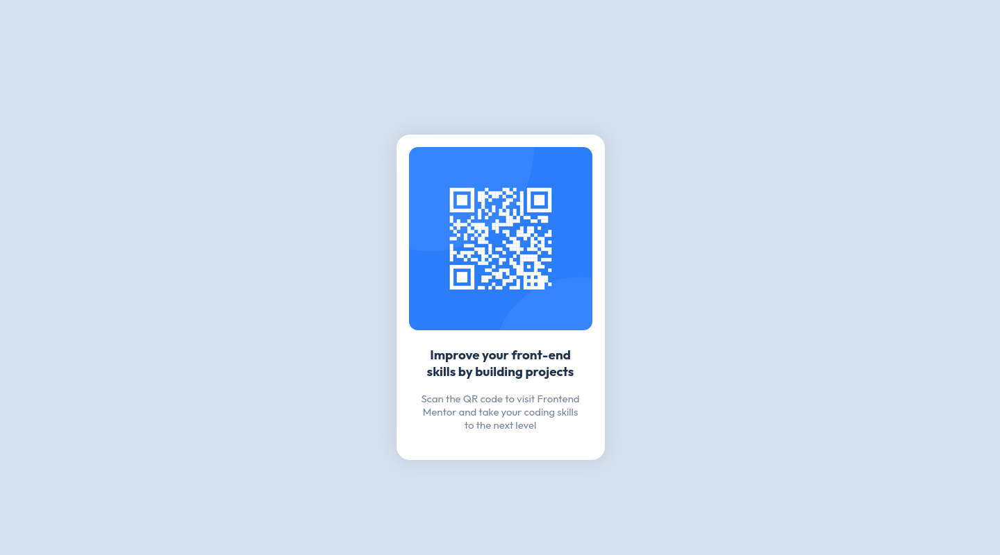

# Frontend Mentor - QR code component solution

This is a solution to the [QR code component challenge on Frontend Mentor](https://www.frontendmentor.io/challenges/qr-code-component-iux_sIO_H). Frontend Mentor challenges help you improve your coding skills by building realistic projects. 

## Table of contents

- [Overview](#overview)
  - [Screenshots](#screenshot)
  - [Links](#links)
- [My process](#my-process)
  - [Built with](#built-with)
  - [What I learned](#what-i-learned)
- [Author](#author)

### Screenshots




### Links

- Solution URL: [GitHub Repo](https://github.com/orlowski-dev/orlowski-dev.github.io/tree/main/qr-code-component)
- Live Site URL: [GitHub Pages](https://orlowski-dev.github.io/qr-code-component/)

### Built with

- Semantic HTML5 markup
- CSS custom properties
- Flexbox
- Mobile-first workflow

### What I learned

I learned how to:
- import fonts into stylesheet file
```css
@import url('https://fonts.googleapis.com/css2?family=Outfit:wght@400;700&display=swap');
```
- use custom properties
```css
:root {
  --white: hsl(0, 0%, 100%);
  --light-grey: hsl(212, 45%, 89%);
  --grayis-blue: hsl(220, 15%, 55%);
  --dark-blue: hsl(218, 44%, 22%);
}

main {
  background-color: var(--light-grey);
}
```
- center element using flexbox
```css
main {
  display: flex;
  align-items: center;
  justify-content: center;
}
```


## Author
- Frontend Mentor - [@orlowski-dev](https://www.frontendmentor.io/profile/orlowski-dev)
